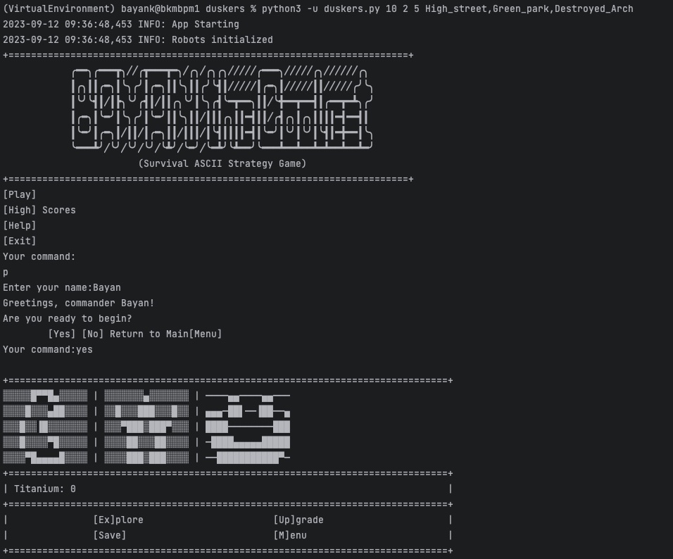

# Welcome to Dusker

- A text-based adv game in Python
- Trying out several different techniques for validating user input
- Can run this without any args, or run with positional args specified such as: 
    - python3 -u duskers.py 10 2 5 High_street,Green_park,Destroyed_Arch

## Here is a preview:
